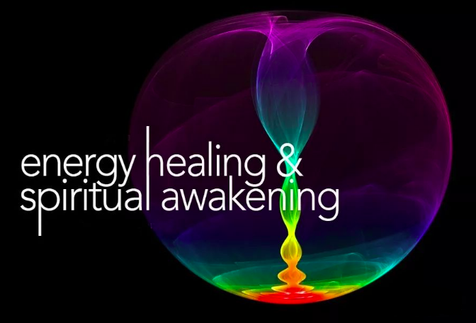

# 认识脉轮

作者：千帆过

> 网站：http://www.rendejiedu.com/
>
> 微信公众号：人的解读（ID: rendejiedu）
>
> 图片较多，等待而刷新，则缓存生效。

- [认识脉轮](#认识脉轮)
  - [脉轮入门简明教程，脉轮的奥秘都在这里](#脉轮入门简明教程脉轮的奥秘都在这里)
  - [脉轮的起源，为何必须要了解它？](#脉轮的起源为何必须要了解它)
  - [脉轮和经络到底有啥区别，为何解剖上都发现不了？](#脉轮和经络到底有啥区别为何解剖上都发现不了)
  - [脉轮和穴位大不相同，究竟意味着什么？](#脉轮和穴位大不相同究竟意味着什么)
  - [脉轮和人的七层身体，神奇远超你的想象！](#脉轮和人的七层身体神奇远超你的想象)
  - [从宇宙能量场到精微能量、挠场，脉轮连通了超自然世界](#从宇宙能量场到精微能量挠场脉轮连通了超自然世界)
  - [从出生到死亡，脉轮决定着每个人生阶段的发展](#从出生到死亡脉轮决定着每个人生阶段的发展)
  - [疾病的真相，不懂这些就不会有真正的健康](#疾病的真相不懂这些就不会有真正的健康)

## 脉轮入门简明教程，脉轮的奥秘都在这里

《人体能量学的缘起》提及了古埃及的能量医学，可惜已失传。未来也是能量医学的天地，目前能找到的切入点，主要有两个：一个是古中医体系的经络系统，一个是古印度医学体系的脉轮系统。

在《人体能量学-经络篇》里，已通过20篇文章探讨了经络的奥秘。

本文算是《人体能量学-脉轮篇》的总结吧，通过22篇文章探讨了脉轮的奥秘。

**1.脉轮到底是什么**

学习脉轮，首先要搞清楚的，就是《脉轮的起源，为何必须要了解它》。

通常认为，脉轮源于四千年前的印度。不过墨西哥的玛雅人、秘鲁的印加人和北美的切洛基人（北美印第安民族），都有各自的脉轮系统。玛雅人甚至认为，是他们把脉轮系统的知识传授给印度教徒。

这么多古文明里都提到脉轮，那么脉轮究竟是什么呢？

脉轮，这个词在梵文中的意思是“轮子”(wheel)，也就是“光之轮”。脉轮也被叫做莲花，绽放的花瓣象征着脉轮的打开。

在印加传统里，把脉轮称为“光之眼”或者“光井”，而把经络称为“光的河流”。所以，我们可以拿经络来和脉轮一起来看。

**2.脉轮和经络有何区别**

解剖学上都研究到分子层面了，还没找到经络是什么东西，但是经络系统我们却用了几千年，现在依然还在用。脉轮同样如此，那么《脉轮和经络到底有啥区别，为何解剖上都发现不了？》

这是因为，现代生物学所研究的“物质身体”只是人体七层身体中的第一层，《脉轮和人的七层身体，神奇远超你的想象》。我们并非只是肉体的存在，还有另外几层身体，以能量体的形式存在，一层一层相互嵌套。所以，研究脉轮，就不能停留在物质身体层面。

在《脉轮和穴位大不相同》里提到，穴位像山峰，脉轮似漩涡。脉轮是圆锥形的结构，它通过旋转将能量吸入中心，就像龙卷风吸引物体一样。这是较大脉轮的情形，如果特别微小的脉轮，跟穴位就非常相似了。

七大主要脉轮，位于能量线彼此交叉二十一次的端点。能量线交叉十四次的端点上，形成了21个次要脉轮。能量线交叉七次的地方，创造了更小的漩涡，称为较小脉轮，数量为49个。能量线交叉更少次的位置，还有许多微小的能量中心，这些微小漩涡可能就是中医里的针灸穴位了。

所有主要脉轮、次要脉轮、较小脉轮以及针灸穴位，都是能量流入与流出身体的开口。

**3.脉轮有啥作用**

我们知道，“经脉者，所以能决死生、处百病、调虚实，不可不通。” 经络的通畅，关乎着生死、疾病。脉轮也是同样的重要。

脉轮，就是用旋涡这种螺旋运动方式来存储和管理所谓的生命能量。这种生命能量，古印度灵性传统称之为「普拉纳」（Prana），古中国称之为「气」（Chi），而犹太卡巴拉称之为「星光」（Astral Light)。

在物理学上，这种超自然世界的能量，叫做精微能量（subtle energy），有别于通常说的物质能量（physical energy）。脉轮的作用就是，《从宇宙能量场到精微能量，脉轮连通了超自然世界》。

《从出生到死亡，脉轮决定着每个人生阶段的发展》，这个得好好了解。灵魂的转世，就是不断地从精微能量体向下投射到较稠密的能量体，然后通过顶轮最终进入了肉身。死亡时一道亮光从头顶闪出，灵魂透过顶轮离开地球层面。

脉轮不仅决定着你的灵魂发展，还决定着健康状况。脉轮失衡会导致生病，且疾病的严重程度反映出脉轮失衡的程度。脉轮的失衡以三种方式呈现：阻塞、受到过度刺激、不协调。

在健康的能量系统中，脉轮会有节奏地同步旋转，从宇宙能量场中吸收能量，提供身体使用。如果能量系统不健康，脉轮的转速不会是同步的，可能过快或过慢，不规律或不均衡，有时还可观察到破裂的情形。这就是《疾病的真相，不懂这些就不会有真正的健康》。 

**4.脉轮如何诊断**

西医有X光、核磁等各种仪器设备，中医诊断有脉诊，那么脉轮状况的诊断靠什么？检査脉轮状况的方式有好几种，目前侦测脉轮能量最常用的方法，就是使用灵摆。通过灵摆转动的方向、转动幅度大小来判断。

最直接的诊断方式还是灵视。因为能看见脉轮的旋转状况（是否规律）、颜色（是暗沉堵塞、稀释淡薄，或干净明亮且色泽浓密），也可能看到它有没有变形，以及变形的情况。而且《从灵摆到灵视，脉轮诊断就是认知世界真相的过程》。不过，具有灵视能力的疗愈师还是比较少。

网上也有通过做题来测试脉轮的，这个逻辑，就像是你去医院看病，来，做几道题吧，不用做检查了。哪个医生会给你这么诊断呢？所以，你把它当个游戏就好。

**5.如何疗愈脉轮**

普通治疗就是治疗师在发挥作用为你医治，但疗愈却有时候不仅仅是疗愈师，还可能会有指导灵（spiritual teachers）的参与。

疗愈师可以让指导灵进入能量场，协助疗愈，进行所谓的灵性手术。整个疗愈过程，如果没有指导灵的参与，可能很难顺利完成。所以会有《疗愈的过程，神与我同在》。

在《前世疗法：打开身心灵健康的一扇大门》里曾提到了各种生理问题、心理问题、人际关系冲突等，都与前世创伤有关。前世创伤也会通过脉轮影响到今生的。

所以，疗愈的目的不仅在于疗愈身体，更重要的目的是在疗愈灵魂。这就是《跨越时空的疗愈：前世创伤和来生功课都写在脉轮里》。

**6.七大脉轮系统**

上面粗略介绍了从脉轮到疗愈的基础知识，主要是基于七脉轮体系，目的是为了简化便于理解。七脉轮体系是所知最广的，在西藏密宗里就有三脉七轮的说法。

这七大脉轮，由下往上分别是：海底轮、生殖轮、太阳轮、心轮、喉轮、眉心轮、顶轮。

接下来你需要逐个了解每个脉轮的位置、功能、失衡的案例、练习的方法等。 

海底轮，是能量门户。海底一开，百穴皆开；中脉一通，百脉俱通。如果第一脉轮堵塞，会导致严重的能量枯竭，而且对你的体力影响很明显。所以《第一脉轮：海底轮，你的能量之门必须敞开》。

生殖轮，也称腹轮，这个脉轮是性欲的中心，所以又叫做性轮。如果说生殖系统，重心在性器官，那么生殖轮，重心在性能量。

这个脉轮若受到阻碍，产生的影响就是降低身体与性爱的活力。所以《第二脉轮：生殖轮，性能量的转换你必须要学会》。

太阳轮，也叫太阳神经丛轮。如果这个脉轮受阻碍，那么心轮与性轮将分别发挥作用，也就是说，性不会跟爱深入接轨，反之亦然。

因为它像太阳一样闪烁着光辉，是一个发光发热的能量中心，也是一般所称的“力量中心”。所以《第三脉轮：太阳轮，你的力量中心必须开启》。

心轮，是七大脉轮系统的中心点，有承上（上三轮）启下（下三轮）的作用。我们在心轮这个层次体验到的爱，跟第二脉轮的性欲或激情之爱截然不同。

心轮是疗愈过程中所使用最重要的脉轮，因为爱是终极的疗愈力量。所以，《第四脉轮：心轮，爱的中心怎能不开启？》

喉轮，是沟通中心，是一个人获得知识的脉轮。有意思的是，喉轮和性轮之间有很强的联系。强大的喉轮意味着性轮也会强大，这就是为什么极富创造力的人有强烈的性冲动。然而，强大的性轮并不意味着喉轮也会强大。

声音有能量调和我们内在与周遭的不和谐频率。所以，要了解《第五脉轮：喉轮，沟通中心与神奇的声音疗愈》。

眉心轮，就是一般人所知的“第三眼” ，代表着全知全见的秘密智慧。通灵能力发展最重要的层次，就是在第六脉轮上的灵视，前面的脉轮诊断里就特别提到了它的重要性。

通过灵视可以看到在每个脉轮中看到许多颜色，里里外外缠绕着脉轮，形成与当事人的生命相关的图案和意象。所以，《第六脉轮：眉心轮，第三眼与神奇的色彩疗愈》得好好了解。

顶轮，就是七大脉轮的顶峰，这也是人们常言的盛开于头顶的千瓣莲花。前面提到过，顶轮也是人类生命的入口和出口，当出生时，灵魂由此进入，当死亡时灵魂由此而出。

这个脉轮，让我们与神圣智能（或称为宇宙意识）及一切成相的源头连接在一起。所以，《第七脉轮：顶轮，开悟之门你需要打开》。

前面提到的疗愈脉轮那是找疗愈师，平时，我们可以做一下平衡脉轮的练习。每个脉轮之间的平衡，远比尝试将一个脉轮大幅度打开更加重要。

关于脉轮练习，《光之手》中提供了一套简单的运动练习。里面还提到，昆达里尼瑜珈是个非常好的选择，用呼吸和体位运动开启脉轮并充能。

《脉轮全书》则推荐了一些哈他瑜伽的练习。《禅密功》里的筑基功法可以试试，百日筑基，基础要打好。

要发展第七脉轮，没有比静心更伟大的修行了。只有透过静心，才能了悟自性。静心也叫被作观想 (Visualization) 或者冥想（Meditation），《脉轮全书》有很多冥想练习，可以试试。

**7.十二脉轮系统**

除了七大脉轮之外，还有另外五个体外脉轮，但这五个脉轮并不位于人体内。这些脉轮加在一起就是十二脉轮系统。

不像七大体内脉轮那样，有着科学实验的研究支持（例如杭特博士的研究）。关于五个体外脉轮，目前还没有人测量或记录过，但是《精微体》作者Cnydi Dale这样的疗愈师，藉由自身从事能量疗愈的经验发现了它们。

- 
  这五个体外脉轮分别是： 

- 《第八脉轮：灵魂之星，你的阿卡西记录和生命之书都在这里》
- 《第九脉轮：灵魂之座，你的生命目的就在这里》
- 《第十脉轮：地球之星，你与盖亚的连接就在这里》
- 《第十一脉轮：嬗变之轮，召唤并掌握超自然的力量》
- 《第十二脉轮：次要脉轮，传导灵光场之外的灵性能量》

要注意的是，第十二脉轮并不是某个具体的脉轮，而是次要脉轮的集合。

另外还要说的是，不同的十二脉轮体系，这五个体外脉轮的位置、名称差异都非常大。如果你不是疗愈师，仅仅了解一下就可以了。

每个人都有个发光的能量场，我们通常称为气场，下个系列就写《人体能量学-气场篇》。

经络是能量通道，脉轮是能量中心，气场是能量场，我把这三个系列合称为“人体能量学系列三部曲”，相信会让你对人体有更加深入的理解。

## 脉轮的起源，为何必须要了解它？

在《人体能量学的缘起》中提及了两大能量系统：一个是古中医体系的经络系统，一个是古印度医学体系的脉轮系统。

其实，在八千年前的古埃及时代，能量医学就很普遍了，更别说两万年前的亚特兰蒂斯时代，主流就是能量疗法。然而，这两个文明已中断，我们先不做探讨，重心放在不算久远的经络和脉轮系统上。

在《人体能量学-经络篇》里，通过20篇文章探讨了经络的奥秘。没想到这个系列那么受欢迎，我想原因无非是，哦，经络原来是这么回事，或者，经络还可以这样来解释。

毕竟解剖学上都研究到分子层面了，还没找到经络是什么东西，但是经络系统我们却用了几千年，现在依然还在用。这就是传统和现代的矛盾点，非常吸引人。

接下来呢，我们就再看看脉轮这套能量体系到底是怎么回事。《人体能量学-经络篇》主要是基于《人体的彩虹》作者张长琳教授的研究成果，那么接下来的《人体能量学-脉轮篇》则主要基于《光之手》作者布蓝能的成果。

两人都是物理学背景，一个研究的经络，一个研究的脉轮。因为我也有着物理学背景，因此他们的风格非常合我的口味，接下来的脉轮篇，我就把对脉轮的探索分享给大家。

**脉轮是什么？**

脉轮，源于四千年前的印度，这个词在梵文中的意思是“轮子”(wheel) 或圆盘(disk），也就是“光之轮”，表示能量的交汇点。脉轮也被叫做莲花，绽放的花瓣象征着脉轮的打开。

在印加传统里，经络被称为“光的河流”。经络和脉轮可以将人与一个发亮的能量场(HEF) 连结，然后创造并维持现实。

脉轮是能量的转化器，可以把能量从较高的振动频率，转换成较低的振动频率；反之亦然。这个理解起来比较困难，那么脉轮到底是如何运作的呢？这正是通过本系列文章要探讨的问题，这里暂且略过。

 

**脉轮的起源**

脉轮(Chakra)，其实是和瑜伽的学问与实践联系在一起的。瑜伽(yoga)的字面意思是“结合”或“和谐”，瑜伽的起源及早期的脉轮概念，都要追溯到吠陀经典。比如《阿闼婆吠陀经》(Atharva Veda)里提到过脉轮和能量流的概念。

在《吠陀经》之后，有《奥义书》，公元前600年左右产生的《瑜伽奥义书》和公元前200年左右出现的《帕坦伽利瑜伽经》中，都提到脉轮是意识的灵性中心。

帕坦伽利在《瑜伽经》中把瑜伽系统化和规范化，构成了当代瑜伽修炼的基础，就像《黄帝内经》中把经络系统化，奠定了理论和实践基础一样。所以，从某种程度上说，脉轮也是瑜伽哲学的组成部分。

 

再后来，就衍生出谭崔(Tantra)的概念，谭崔的梵文字面意思是“织布机”，表示要把一些分散的丝线编织成一块完整的挂毯。谭崔融合了印度传统里的许多灵性教诲，在公元6-7世纪开始大行其道。

不过墨西哥的玛雅人、秘鲁的印加人和北美的切洛基人(北美印第安民族），都有各自的脉轮系统，玛雅人甚至认为，是他们把脉轮系统的知识传授给印度教徒。

这种说法倒也可能，埃德加‧凯西(Edgar Cayce)说过，公元前1万年，亚特兰蒂斯文明最后的一个岛屿沉入海底，美国有一个叫Iroquois的印第安部落，就是纯粹的亚特兰蒂斯人的后裔。

甚至，我认为经络系统，可能也与亚特兰蒂斯人的后裔有关。毕竟亚特兰蒂斯时代，能量疗法就已经非常普及。 

脉轮系统以迂回的方式，慢慢流传到西方世界。比如16世纪《六个脉轮探索》(Sat-Chakra-Nirupana)中，完整介绍了脉轮的概念。 20世纪初《灵蛇的力量》(The Serprent Power) 把脉轮知识引进了西方世界。

再之后的系统之作，就是1987年朱迪斯(Anodea Judith)的《脉轮全书》(Wheels of Life），不过太偏重于心理层面的解释。

最经典的就是1988年布蓝能(Barbara Brennan)的《光之手》(Hands of Light)，这本书被誉为能量疗愈领域“圣经”，至今没有任何一本能量疗愈书能超越它。我写的这个脉轮系列就是以本书为蓝本进行探索。

再后来，比较经典的就是1994年布鲁耶尔(Rosalyn Bruyere)的《光轮：脉轮、光环和身体的疗愈能量》以及2009年辛迪‧戴尔(Cyndi Dale)的《脉轮疗愈全书》。

 

脉轮这套东西，在印度搞得很神秘，成了“秘传知识”，禁止向有家庭或工作的人传授。而且谭崔，把这套东西搞得名声也不太好。其实，脉轮不需要那么神秘，就像经络一样，是可以造福更多人的。

在国内，脉轮也很少谈及，图书平台也搜不到一本“脉轮”书籍，原因你懂的。不过，这么重要的东西，如果不了解，那么这一生真的有些白过了，所以有了脉轮这个系列。

 

**脉轮有多少个？**

脉轮可分为主要脉轮和次要脉轮。主要脉轮，最常见的说法是7个，就是七大脉轮，比如在西藏密宗里就有三脉七轮的说法。谭崔(Tantra)系统主张脉轮有8个。

《精微体》作者辛迪‧戴尔(Cyndi Dale)认为，除了七大脉轮之外，还有另外5个脉轮，但这5个脉轮并不位于人体内。

《光之手》作者芭芭拉‧布蓝能(Barbara Brennan)则能看到第八、第九脉轮，位置是在头顶上方。

《晶体的传送》作者卡崔娜‧拉斐尔(Katrina Raphaell) 则提出了十二个脉轮之说。总之，大部分系统都同意最基本的七个脉轮之说。当然，还有文献则有五个脉轮、六个脉轮的学说。

次要脉轮就太多了，有的认为有120个，有的认为更多，还有人认为，次要脉轮就是经络上的穴位。

了解得越多，越发觉得，经络根本不是通过临床观察积累出来的，而是有内观能力的人画出来的。脉轮系统也不是试验出来的，是有人就是能“看到”，比如光之手的作者布蓝能等人。

本系列文章，就是希望能对脉轮体系有更深入的探讨，搞清楚脉轮到底是怎么回事，跟经络有何关系，以便更好地了解人的真相，更好地度过此生。

## 脉轮和经络到底有啥区别，为何解剖上都发现不了？

在上一篇《脉轮的起源》里提到，在十二脉轮之说里，有五个脉轮是在体外的。这说明，脉轮也是解剖上发现不了的，因为在体内的话，还有可能，但在体外的，你咋解剖出来呢？

正如《经络到底是什么，为何解剖学上找不到》一样，即便是在体内的脉轮，也绝不可能是解剖出来的，而是有内观 (或称灵视)能力的人看到的。

那么问题来了，既然是灵视看到的，那经络系统和脉轮系统究竟有何区别呢？如果脉轮那么重要，为啥在中医体系里，就没有脉轮的概念呢？

脉轮系统里有两个重要概念：脉轮(chakra)、气脉(nadis)，我们先来看一下。

**脉轮**

脉轮(chakra)，在梵文中的意思就是“轮(wheel)”或“盘(disk)”，用来形容它的螺旋运动，而脉轮就是用这种螺旋运动方式来存储和管理所谓的气，或称生命能量。

 

在有些文献中，脉轮就是旋涡(vortex)，你可以把它理解为类似双向换气扇的东西，只需转换不同的旋转方向，就可以实现排气或送风(吸气)的功能。

可以说，脉轮就是人体的一个“换气扇”，只不过交换的不是空气，而是能量。到底是啥能量呢，后续篇章里再详解。

虽然脉轮数量各个派别不同，但都有七大脉轮，我们这个系列呢，主要探讨七脉轮系统。

脉轮也称为"光轮"，光轮的大小、颜色、明亮程度不一，其中最大也最明亮的三个“光轮”，在中医学的文献中被称为“丹田”，分别是“上丹田”、“中丹田”和“下丹田”，因为这些“光轮”是在体内而不是体表，因此中医又称为蓄气之处。

那脉轮和穴位有啥关系呢？我们后续再探讨。

 

**气脉**

脈的梵文nadi，字根是nad，意思是移动。根据《梨俱吠陀》(Rigveda)，nadi意思是指“溪流”，非常贴切，因为气脉就是负责输送各种能量至全身。

我们可以把气脉想象成电话线、燃气管道或河道，不同类型的能量在特定的管道中运行，然后流经同一个能量旋涡。

气脉，就是脉轮的通道，或者传递系统。气脉的概念，由后来的奥义书以及瑜伽和谭崔体系进一步发展。

 

**三脉七轮**

气脉的概念跟经络很类似，中医认为人身上有十二正经，奇经八脉，印度教和密宗认为人身上有三脉七轮。

虽然除了七轮，也有十一轮、十二轮之说，但几乎所有的脉轮派别都同意人体内有三个主要的脉，分别为中脉（或主脉）、左脉和右脉，称为三脉。

这三条贯穿七大脉轮的主要能量传送通道，就是我们所俗称的“气脉(nadis)”。

 

七大脉轮组成了我们身体里的一根垂直气柱，这就是“中脉”。中脉位于脊柱内，从脊柱底端延伸至脑中央。中脉就是连接各个脉轮，并把这些能量加以整合的中心管道。

在中脉左侧的的叫左脉，在右侧的叫右脉。左脉和右脉则像交缠的双螺旋，好似有两条蛇（左脉和右脉）盘绕在权杖上一样，在顶端回合。

三条脉会交互作用，主要的脉轮都是靠中脉滋养。

 

疾病的产生就是因为这些提供宇宙生命能量的流通管道受到干扰所致。这个干扰可能发生在运送能量的七个脉轮或三条经脉当中的任何一个点上，从而导致身体缺乏所需要的能量（气），致使病痛和疾症发生。

要治愈疾病，就需要把这些干扰释放掉才行。这跟中医经络所说的，通则不痛，痛则不通，其实是一样的道理。

 

**气脉的数量**

当然，能量除了在三大经脉里运行之外，也会去到许多支叉路，跟中医里的经脉、经别、络脉的概念差不多。

第一本奥义书认为人体有七万二千条脉，其他奥义书则认为有一千至三十五万条脉之间。不过，包括印度传统医学“阿育吠陀”和西藏传统在内的大部分系统，都同意人体内约有七万二千条不同的脉。比如其中有古文献是这样描述的：

“自我存在于心脏，而这也是一体性和一百条脉的汇合点，从这一百条脉每一条再生出百条分脉，之后再生出七十二条分脉，每一条衍生一千倍，Vyana在其中遍行流动。”

另外，《佛说入胎经》里也提到，人身有七万多条脉道，气脉走的路是七万多条，这里讲的也是个大约数。

 

**经络的数量**

经络呢，有经脉和络脉之分，经脉有十二正经、奇经八脉，加起来是二十条。络脉有孙络、浮络之分，数量更多了。

《针经指南》说：“络有一十五，有横络三百余，有丝络一万八千，有孙络不知其纪。” 《明络脉之法•络脉论》说道：“十二经生十二络，十二络生一百八十系络，系络生一百八十缠络，缠络生三万四千孙络。” 可见经络的数量也是不计其数的。

不管是气脉也好，经络也好，描述的都是人体的能量网络。 脉轮系统的网络，是三脉加上七万二千条不同的脉。经络系统的网络，是十二正经加上奇经八脉以及三万四千孙络。

其实这些数以万计的数字，都是个约数，再细分的话，还会更多，就像人的血管系统一样，毛细血管有无数。血管系统，输送的是物质，而气脉（经络）系统，输送的是能量。

 

**气脉与经络的区别**

气脉和中医里的经络，都是负责输送能量，但仍有些差异。南怀瑾老师认为，印度注重的三脉七轮，同中医道家所注重的十二经脉、奇经八脉完全不同。

不过，本山博(Hiroshi Motoyama)博士认为气脉和经络可能是相同的。他认为督脉和中脉有密切的关联，因为就解剖学的角度来看，它们是相连的，而且功能类似。

无论气脉扮演何种角色，都与脉轮、经络和神经有紧密的连接。而这种紧密连接，恰恰是脉轮最神秘的地方，吸引着我孜孜不倦地去探索。

 

在后续篇章里，我们就来探讨一下，看看两大能量体系究竟是如何连接在一起的，又如何影响到肉体层面的。

## 脉轮和穴位大不相同，究竟意味着什么？

上一篇《脉轮和经络到底有啥区别》提到了脉轮系统和经络系统的相似性，就是气脉和经络都是能量输送通道，那么作为通道上的重要节点，脉轮和穴位有何不同吗？

**穴位像山峰**

在《穴位有多大》里提到，穴位其实根本没有固定的大小，就像山峰一样，你若非得问山峰有多大，首先得确定采用哪个等高线来衡量。

穴位的正中心电导最大，越远离穴位中心电导越小。 通过电导的测量，就可以描绘出类似等高图一样的穴位图。

这就是说，穴位并不像针灸铜人上的小洞洞，具有清楚的边界和明确的深度，而是像一座边界不清的小山峰。

经络呢，就像是一道山脉似的东西，而穴位则像这道山脉的一座座山峰，这些是对于经络穴位形态的最新看法。

那么脉轮呢？也像山峰一样，没有固定大小吗？

 

**脉轮似漩涡**

脉轮和穴位，有着显著的不同。脉轮呢，不像山峰，倒似漩涡。脉轮的运作方式看起来与我们所熟悉的水中或空气中的漩涡、龙卷风、水龙卷和飓风等流体涡流相似。

在《经络之所以解剖不着，原来因为它是耗散结构》中提到，这种不停地耗能才能形成的结构，称之为耗散结构。

 

每个旋转的涡流，都呈现出从宇宙能量场吸入或输送能量的状态。就是说，每一个漩涡皆与宇宙能量场交换着能量。

所有主要脉轮、次要脉轮、较小脉轮都是能量流入与流出的开口。 

**脉轮的圆锥形结构**

仔细看看，脉轮是圆锥形的结构，它通过旋转将能量（后续篇章详解）吸入中心，就像龙卷风吸引物体一样。这些能量滋养了人体能量场，同时也带入了周围宇宙能场中的信息。

一个正常脉轮（七大脉轮），其敞开的末端面积直径约15公分，距离身体约2.5公分的距离。看起来，脉轮确实不小，比穴位是大多了。

 

**脉轮的次级结构：小旋涡**

如果我们进一步观察脉轮，会发现跟穴位还有一个不同，脉轮还有次级结构。每个脉轮，都由一些更小的旋涡组成，这些旋涡整齐的排列在大脉轮圆锥内，就像花瓣一样。

 

第一脉轮只有四个小旋涡，而顶轮据说有接近一千个小旋涡。随着脉轮的提升，旋涡变得更小，更加难以看清其数量。不同的灵修传统中，脉轮的 小旋涡，或称“瓣数 ”也不同。

| 脉轮      | 小旋涡数  |
| --------- | --------- |
| 7顶轮     | 972紫白色 |
| 6头部     | 96靛蓝色  |
| 5喉轮     | 16蓝色    |
| 4心轮     | 12绿色    |
| 3太阳丛轮 | 10黄色    |
| 2骶骨轮   | 6橙色     |
| 1根轮     | 4红色     |

**脉轮成对出现**

需要注意的是，脉轮是成对，这又是跟穴位不同的地方。也就是说，每一个位于身体正面的主要脉轮，与身体背面对应部位的脉轮为一对，正面(A)与背面(B)的脉轮被视为同一个脉轮。

比如七大脉轮中， 1、7轮是一对，而 2、3、4、5、6是在身体前后成对。

第二脉轮由2A 和2B 两个组成，第三脉轮由3A 和3B所组成，以此类推到第六脉轮。第一脉轮和第七脉轮，如果希望配对的话可以视为一对，因为它们是在脊椎上下流动、将能量运行到所有脉轮所处的垂直能量流的顶端与末端。

很特别的是，脉轮内的小旋涡也是前后成对的。这一点在重构各层面脉轮时非常有用，某个脉轮（或小旋涡）受损，也会影响到其对侧的脉轮。

每个脉轮中的小旋涡，都在各自不同的层面上代谢着不同频率的能量，然后能量被输送到身体的不同部位、器官和细胞，用于身体的健康运转。

如果脉轮受损，或者小旋涡受损，整体脉轮会呈现出其他形状，就像下图那样。

通过七大脉轮和穴位的对比，我们发现了三个显著的不同。一是穴位像山峰，脉轮更像漩涡。二是脉轮还有次级结构，就是由更多微小的漩涡组成。三是脉轮成对出现，而穴位并不是。这意味脉轮有着比穴位更重要的作用。

**脉轮与七层气场**

脉轮的尖端或顶端连接着主要能量流，称之为脉轮的根部或中心。在这些中心之内有许多封口，控制透过该脉轮在不同气场层之间进行的能量交换。

 

也就是说，七个脉轮的每一个脉轮都有七层，脉轮的每一层也都对应着一层气场。脉轮在每一层的长相皆不同，我们将在描述每一层时做详细的说明。

为了让某股能量流可以透过脉轮从一层流到另一层，能量必须通过脉轮根部的封口。比如下图中，就显示了七层相互渗透的整个气场，以及贯穿七层的脉轮。

后续篇章我们就来揭示这七层到底是啥，这可是引人入胜的神秘之处。

 

为了写这个脉轮系列，我参加了几次意象疗愈（能量疗愈），有海外的朋友羡慕国内体验机会多，有伙伴同行。其实，能量疗愈领域的牛人，海外更多啊，比如在《脉轮的起源》中提到了几位脉轮领域的大咖：Barbara Brennan，Rosalyn Bruyere，Cyndi Dale，Anodea Judith，都在美国有研究中心，大家可以结伴去体验啊。

为了方便组织参与北美地区的活动，人的解读北美分舵正式成立了！舵主就是每篇文章都会转发的忠实粉@枫之蝶，回国时还专门约我见面聊了聊。在北美的朋友，可以扫码加我微信进入组织了，希望早日看到北美的活动啊！

## 脉轮和人的七层身体，神奇远超你的想象！

上一篇《脉轮和穴位大不相同，究竟意味着什么》中提到了七层身体，说的是，七个脉轮的每一个脉轮都有七层。

 

在《人的电磁场身体，才是经络运行的载体》中就曾提到，现代生物学所研究的“化学身体”只是人体七层身体中的第一层；而 “电磁场身体”，则可能只是人体七层身体中的第二层。

那么，人体的七层身体到底是什么？

**人的七层身体**

人体能量场（HEF）通常被称为“气场”或是“灵光”（Aura）。人的气场是人体与宇宙能量场相连的一部分。

研究人员根据观察，建立了将气场划分为几层的理论模型，这些气场有时也被称为能量“体”（bodies）。

既然是理论模型，层数也因研究者不同而异。比如，布鲁耶尔（Rosalyn Bruyere）使用的是一个七层的系统，在她的著作《光之轮》(Wheels of Light)中有所叙述。

史瓦兹（Jack Schwarz）所使用的气场系统超过七层，在他的著作《人体能量系统》(Human Engrgy Systems)中也有所描述。

《光之手》(Hands of Light) 作者布蓝能（Barbara Brennan）使用的是七层系统。

 

健康的人，气场可以从身体往外延伸60~180厘米，长期疲倦的人的气场会粘附在皮肤上。

 

根据布蓝能(Brennan) 的解释，人的身体层面（Physical Plane），除了肉体(physical body) 外，还包括七个层能量体中的最里面的三层(第一、二、三层)。

最外面的三层(第五、六、七层)则是灵界层面（Spiritual Plane），中间的第四层是灵界与物质界之间的桥梁，称为星光层面（Astral Plane）。

 

注意哦，我们探讨气场的七个层次，或者说七个能量体，它们相互渗透并且在各层中依次包围着彼此。

啥意思呢？就是说，它不像洋葱那样每层占据了不同的空间。我们的七个能量体，都同时占据着同一个空间位置，每一个体都向外扩展，超过前一个体。

这是我们在日常生活中所没有用到的概念。你可以把气场想象为俄罗斯套娃，层层相互嵌套，每层都向外扩展。由于每一层的振动频率都比其下一层高一倍，因此同一个脉轮可以在不同层套叠存在。

 

接下来，就让我们逐一看看每层到底是怎样的。

**第一层：以太体（The Etheric Body）**

这里借用了“以太”（Aether）的概念，最早提出这个概念的是亚里士多德，他认为世界由五种元素组成，分别是水、火、土、气、以太，前四者组成了地球，而以太则充斥在整个宇宙之间。

以太体，是由一张闪烁的微小的能量线所组成，是一种网络状结构。以太体的网络状结构不断运动着。通过灵视能力可以看到，蓝白色光的火花沿着遍布于整个身体的能量线移动。以太体有规律地跳动着，大概每分钟15~20个循环。

以太体的范围，从身体扩展出去约0.6~5厘米。

以太体的顔色从淡蓝色到灰色不等。相较于灰色，淡蓝色表示它已与一种更精微的形态连结。一个较为敏感的人，往往以太体会带点儿蓝色；而运动型、健壮的人，以太体往往呈现为灰色。

这一层所有脉轮的颜色与该层能量体的颜色相同。也就是说，也介于蓝色到灰色之间。脉轮看起来象是以光网制成的漩涡，就像以太体的其余部分一样。可以从以太体感知身体的所有器官，不过，这些器官也是由这种闪烁的蓝光所塑成的。

这意味着，以太体具有与身体相同的构造，包括所有物质肉体的结构和全部的器官。肉体组织之所以存在，是因为有维持生命所必须的能量场支持着。也就是说先有能量场，然后再有的物质身体。

 

**第二层：情绪体（The Emotional Body）**

第二层能量体，也就是在以太体之外更精微的次层，通常被称为情绪体，与感觉相关联。情绪体大致依循着身体的轮廓，其结构远较以太体易变，并且并没有复制肉体的结构。

它似乎更像是不断流动着的、由精微物质构成的彩色云朵。情绪体的范围，从身体扩展出去约2.5~7.6厘米。

它的颜色从艳丽清晰的色调到黑暗混浊都有，取决于制造它们的能量或情感是清晰还是混乱的。清晰与能量充沛的情感，譬如爱、兴奋、喜悦或愤怒是明亮清楚的；困惑的情感则是暗沉且混浊的。

情绪体就像七彩云一样，包含彩虹的所有顔色。每个脉轮看上去像是颜色各不相同的漩涡，依循着彩虹的色彩排列。以下列出情绪体脉轮的顔色：

- 第一脉轮=红色

- 第二脉轮=红橙色

- 第三脉轮=黄色

- 第四脉轮=明亮的草绿色

- 第五脉轮=天空蓝

- 第六脉轮=靛蓝色

- 第七脉轮=白色

**第三层：心智体（The Mental Body）**

第三层能量体是心智体，这层能量体在情绪体之外，由更精微的物质所组成，皆与思想和心智过程相关。

这层能量体通常会显现出明亮的黄色光芒，从头部和肩膀放射出来并扩展围绕着全身。当人专注于心智过程时，它会扩展和变得更明亮。

心智体的范围，从身体扩展出去约7.6~20厘米。心智体也是一个结构化的能量体，它包含了我们的思想结构。

 

**第四层：星光体（The Astral Body）**

星光体，是没有固定形状的，由更美丽的色彩云状物所组成。星光体的颜色往往和情绪体是同一组，不过这些顔色通常还会渗入玫瑰色的爱之光。脉轮是和情绪体相同的彩虹顔色，但每一个都浸染着玫瑰色的爱之光。一个有爱心的人，心轮在星光层满是玫瑰色的光。

星光体的范围，从身体扩展出去约15~30厘米。

 

当人们坠入爱河，彼此心之间会出现美丽的玫瑰色弧光。例如，当一个男人或女人在酒吧或派对中幻想着与某人亲热，在能量场中便会有一个实际测试来了解能量场是否同步以及人是否合适。

人们彼此在星光体层级有着大量互动。各种形状的巨大色彩团块迅速地在人与人之间移动，有些是愉快的，有些则不那么令人愉快。在《学会接近磁场不同的人》中我们提到过类似的观点。

 

**第五层：以太模板（The Etheric Template Body）**

气场的第五层称为以太模板，因为它包含了所有物质界存在形态的蓝图或模板。也就是说，它看起来有点像底片一样。

前面提过，以太体是身体的模板，而以太模板则是以太体的模板。能量场中以太体的结构，源自以太模板，它提供以太体取用的蓝图或完美形态。

以太模板的范围，从身体扩展出去约45~60厘米，看起来像一个狭窄的椭圆形，包含了整个能量场的结构，包括脉轮、身体器官和身体形态（四肢等）皆为负片形式。

生病时，以太体会损毁变形，以太模板的工作，就是用其原始模板的形式来修复以太体。它是声音创造物质的层面，在这个层面上运用声音于疗愈是最有效的。

以太体模板，是以清晰或透明的线条、背景为钴蓝色的形式所显现，与建筑师所绘蓝图十分相像，只是这个蓝图存在于另一个次元。就好像将背景空间全部填满构成形状，而留白之处则创造了形状。

 

**第六层：天人体（The Celestial Body）**

第六层为灵性面的情绪层，称为天人体。它的范围，从身体扩展出约60~82.5厘米。

天人体有美丽闪烁的光芒，主要是由柔和的色彩所组成。它的光芒有着金、银光泽及乳白色的质地，很像珍珠贝母亮片。

它的形式不如以太模板层明确，似乎只是由身体散射出来的光所组成的，如同围绕着蜡烛的光晕。在这光里焕发着更亮、更强的光束。

当敞开的心轮与敞开的天人体脉轮相连结时，无条件的爱就会流动。在此连结中，我们结合了人性之爱，即对血肉之躯的人类同胞基本的爱，加上在灵性之爱中所发现的灵性狂喜。

 

**第七层：因果模板（The Ketheric Template Body）或因果体（The Causal Body）**

第七层为灵性面的心智层，称为因果体。因果体的外形为蛋形，容纳了一个人与此次转世相关的所有能量体。

因果体也是一个高度结构化的模板，由极为耐久的金、银光细线所组成，以将整个气场的形体维持在一起。它包含了一个对应肉体和所有脉轮的金色网格结构。

通过灵视，可感知到闪烁的美丽金光，它的脉冲如此之快，可以用“闪闪发光”这个词来形容。它看起来好似有着成千上万条金线。

这个金色的蛋形从身体扩展出约75~105厘米。因人而异，脚下那端较小，在头上90厘米左右那端较大。如果这个人是非常有活力的，它甚至可以扩展得更宽。

第七层的外缘部分厚度似乎约有0.6~1.2厘米，但非常结实且具有弹性、耐渗透并保护着气场， 就像是蛋壳保护着小鸡一般。在这个层面上，所有的脉轮和能量体形式看来好像皆由金光制成。这层是能量场中最强韧、最具弹性的一层。

 

**超越七层**

其实，除了上面的七层身体，还有第八层和第九层。它们各别与位于头部上方的第八和第九脉轮连结着。

《光之手》作者布蓝能（Barbara Brennan）可以看到这两层，每一层都呈现出清透如水晶般，并由非常细微的高速振动所组成。

《精微体》作者辛迪‧戴尔（Cyndi Dale），就是主张十二脉轮的那位，则能看到第十层，甚至第十一、十二层。这么多层，到底有啥用，我们后续慢慢解读。

 

**气场和脉轮的关系** 

| 层数   | 称谓                                  | 扩展尺寸（厘米） | 颜色                           |
| ------ | ------------------------------------- | ---------------- | ------------------------------ |
| 第一层 | 以太体（he Etheric Body）             | 0.6-5            | 淡蓝色到灰色                   |
| 第二层 | 情绪体（he Emotional Body）           | 2.5-7.6          | 包含彩虹的所有顔色             |
| 第三层 | 心智体（The Mental Body）             | 7.6-20           | 主要是黄色的                   |
| 第四层 | 星光体（The Astral Body）             | 15-30            | 和情绪体同一组,还会渗入玫瑰色  |
| 第五层 | 以太模板（The Etheric Template body） | 45-60            | 清晰或透明的线条、背景为钴蓝色 |
| 第六层 | 天人体（he Celestial Body）           | 60-82.5          | 有着金、银光泽及乳白色的质地   |
| 第七层 | 因果体（he Causal Body）              | 75-105           | 金光                           |

气场的每一层看起来都不一样，且具有各自独特的功能，每一层都与一个脉轮连结。

第一层和第一脉轮，与身体机能以及感觉能力——感觉身体的疼痛或愉悦——相关联。第一层气场连结着身体的自动机制以及自主神经的运作。

第二层和第二脉轮与人类的情绪方面相关连。经由这些脉轮媒介，我们得以拥有情绪生活和感觉。

第三层与我们的心智和线性思维相关。第三脉轮与线性思维有关。

第四层与心轮关连，透过它做为媒介，我们不仅爱我们的伴侣也爱人类整体。第四脉轮吸收并代谢着爱的能量。

第五层与更靠近神圣意志的高等意志相关。第五脉轮与文字力量、透过言语力量来显化事物、聆听、以及对我们的行动负起责任有关。

第六层与第六脉轮与神圣的爱相关。这种爱超越了人类之爱的范围，涵盖了所有生命。它传达的是对保护与滋养所有生命的关怀和支持，将所有的生命形式视为神珍贵之显化。

第七层与第七脉轮与高等心智、认识并整合我们的灵性和身体结构有关。

 

因此，感觉、情绪、思想、记忆与其他我们向医生和治疗者描述的非物质经验，其实在我们的能量系统中都有特定的位置。

了解我们的身体症状如何与这些位置相关联，将帮助我们了解各种疾病的本质，以及健康与疾病两者的本质。

## 从宇宙能量场到精微能量、挠场，脉轮连通了超自然世界

上一篇《脉轮和人的七层身体》提到了人体能量场（HEF）通常被称为“气场”或是“灵光”(Aura)。宗教的大修行者都提过、见过或经验到人类头部周围的光。

**气场颜色的频率，与可见光完全不同**

最精彩的气场研究，是在加州大学洛杉矶分校由华乐利•杭特(Valorie Hunt)博士和罗莎琳•布鲁耶尔(Rosalyn Bruyere)一起完成的实验。一九八八年二月的研究结果显示出下列顔色/频率的关系〔赫兹（Hz = HertZ)〕：

| 超视觉看到的气场颜色 | 频率（Hz）                  | 肉眼看到的可见光颜色 | 频率（THz） |
| -------------------- | --------------------------- | -------------------- | ----------- |
| 蓝色                 | 250-750，1200               | 蓝色                 | 620-680     |
|                      |                             | 青色                 | 600-620     |
| 绿色                 | 250-475                     | 绿色                 | 530-600     |
| 黄色                 | 500-700                     | 黄色                 | 510-530     |
| 橙色                 | 950-1050                    | 橙色                 | 480-510     |
| 红色                 | 1000-2000                   | 红色                 | 405-480     |
| 紫色                 | 1000-2000，300-400，600-800 | 紫色                 | 680-790     |
| 白色                 | 1100-2000                   |                      |             |

气场颜色频率范围约250~2000Hz，而人眼可见光的频率范围约为400 ~790兆赫兹(1 MHz =10^6 Hz)。两者不仅有数量级的巨大差别(百万倍)，而且频谱的顺序也不同。

除了蓝色和紫色有额外的频率带之外，这些频率带的排列顺序 (数值从小到大) 与彩虹颜色相反 (数值从大到小)。捕捉到的这些频率不仅仅是仪器运作的信号，也代表测到的能量。 

**古老传统中的宇宙能量：普拉纳、气、星光**

这种奇特频率的能量，很多古文化都提到过。在超过五千年以上的古印度灵性传统中，谈论着一种称之为「普拉纳」（Prana）的宇宙能量。在公元前三千年，中国人就断定有一种称之为「气」（Chi）的生命能量。从公元前538年左右开始发展的犹太神秘主义神智学「卡巴拉」（Kabbalah)称这些能量为星光（Astral Light)。

韦约翰 (John White)在他《未来科学》（Future Science: Life Energies and the Physics of Paranormal Phenomena)一书中，列出九十七个不同的文化，用了九十七种名称来表示气场的现象。

文化称谓上可以不同，但物理上却需要明确，这些所谓的宇宙能量也好、生命能量也罢，到底是个什么东东？

**灵视能力看到的宇宙能量场**

如果你有灵视能力，可以观察到，宇宙能量场由一系列几何点、脉动的光点、螺旋形、线网、火花和云状物组成，非常有结构。

你可以试试，在一个美好的艳阳天，放松地仰躺在青草地上凝视着蓝天。一段时间之后，你或许就能看到极为细小的生命球（globules of orgone)在蓝天中以波浪纹出现。

它们像是白色的小球，有时带着一个黑点，出现一到两秒，留下轻微的轨迹然后再次消失。

图片

当你继续观察并扩展你的视野，你会开始看到整个能量场在一个节奏下同步脉动着。这些能量小球在晴天时光亮且移动迅速；它们在阴天看来较为透明，移动缓慢且数量较少。

在烟雾弥漫的城市中，它们比较少、黯淡且移动得非常缓慢，说明它们能量不足。

《光之手》作者布蓝能有灵视能力，她观察过最丰富、最明亮、充满能量的小球是在瑞士的阿尔卑斯山，那里经常有明亮的大晴天，所有的一切都覆盖在皑皑白雪之中。显然是阳光为这些小球充满能量。

现在将视线转移到以蓝天为背景的树梢边缘。你可能会在树的周围看到一层绿色的薄雾。你可能也注意到，这层薄雾里面异常地没有小球。

但如果你仔细看，会看到小球在绿色薄雾的边缘改变了它们的波浪纹，并流入树的气场中消失不见。很显然是树的气场吸收了这些细微小球。
 图片

环绕树周围的绿色薄雾呈现的是春天和夏天树叶的生长阶段。早春时期，大多数树木的气场呈现粉偏红的色调，与树木冒出的红色嫩芽颜色相近。

**水晶与植物的能量场**

如果仔细看室内盆栽你也会看到类似的现象。将植物放在明亮的灯光下，让背景为黑色。你可能会看到蓝绿色的线沿着叶子的生长方向闪烁着。它们会突然闪烁，然后颜色慢慢变淡，或许只有在植物的另一侧会再次闪烁。

如果你将手或一块水晶置于植物的气场附近，这些线便会和你的手或水晶起反应。当你将水晶拉离开植物时，会看到植物的气场与水晶的气场维持着接触并延展开来。气场拉起来有点像太妃软糖。

**宇宙能量场的奇特性质**

可见，不止是人、植物，甚至矿物都有着这种气场或能量场，我们统一称之为宇宙能量场（UEF)。

韦约翰博士与史坦利•克里普纳博士(Stanley Krippner)，列出了宇宙能量场的许多特性：

宇宙能量场贯穿所有的空间、有生命以及无生命的物体，并且相互连接着所有物体；它从一个物体流动到另一个；其密度与和源头的距离成反比。

它还依循谐波电感与和谐共振的定律，这个现象发生在敲击音叉时，相近的音叉会开始以相同频率振动并发出同样的声响。

宇宙能量场在物质上具有组织的作用，可以建构出形体，它似乎不只存在于我们所处的三维空间中。物质世界里出现任何变化之前，会先在这个能量场中发生变化。

另外，宇宙能量场似乎总是持续创造出更多的能量，取之不尽用之不绝。

**物质能量VS精微能量**

宇宙能量场为何会有那样的奇特性质呢？

我们知道，能量是物质运动转换的量度，物质运动形式很多，所以能量也有各种不同的形式。在我们日常生活中就会用到许多能量，比如热能、电能、磁能、电磁能、机械能、化学能等。

注意哦，这些都是存在于我们目前的四维时空(3维空间+1维时间)下的概念。

在《从三维时间的角度，谈谈为何未来是可以选择的》提到了拉森物理的时空观(3维空间+3维时间)。拉森时空观念可表达为：宇宙的每一个维度包括一个维度的空间和一个维度的时间，宇宙的维度总数为3。

拉森认为，存在着两个互反的时空结构，空间/时间(space/time)结构，创造了让我们有意识体验的物质世界(physical world)。而时间/空间(time/space)结构，又称为超自然世界(the metaphysical world)

我们把物质世界的能量，称为物质能量（physical energy），把超自然世界的能量，叫做精微能量（subtle energy）。

精微能量其实无法以目前的科学方法确凿地加以测量，因为精微能量占据的是另外一种时空结构，显现于反时空结构里，也就是拉森物理学中的时间/空间(time/space)结构。

被誉为第二个爱因斯坦的威廉•提勒博士(William Tiller)，是研究精微能量的先知型科学家，著有《Science and Human Transformation: Subtle Energies, Intentionality and Consciousness》。

提勒曾说过：我们也许无法透过物理方法测量精微能量，但是有办法可以侦测到它的某些讯号。因为精微能量会在磁性媒介中产生一些电及磁的讯号，让人观察到其影响力。

在《气功为何能治病》提到「气」的实验研究结果，主要就是磁讯号。

精微能量的法则与物质能量截然不同，传播方式也独树一格。根据提勒的模型，经络及脉轮就像天线一样，会侦测来自肉体的讯号，将其传送到更高层的领域。

精微能量，带有反质量、运行的速度高于光速，具有磁性，性质跟挠场(Torsion Field)很像，在《气功为何能治病》有提到过挠场研究。

类似的概念还有很多，比如，扭场(Axion Field)、信息物理场 (Information Physical Field)、自旋场 (Spin Field)、超量子势(Superquantum Potential)、希格斯场(Higgs Field)等，目前用挠场概念发表的文章和研究成果相对较多。

台大李嗣涔教授做过长达 18 年有关气功、人体特异功能的研究，发现“挠场”的很多性质与他发现的“信息场”类似。

听起来太抽象难懂了，等我完成脉轮系列后再详解，先略做一下小结吧。

人体能量场（HEF）也是有颜色的，有灵视能力的人可以看到。不过它的频谱跟可见光完全不同，这意味着它是我们所不熟悉的能量。而且不仅人体有，动物、植物、矿物都有，我们统一称之为宇宙能量场（UEF）。

宇宙能量场的性质不同于我们常见的物质能量（physical energy），似乎不存在于我们这个时空中，我们称之为精微能量（subtle energy），类似的概念还有挠场(Torsion Field)等很多。

根据拉森物理学的互反理论，或许真的有另一种时空结构的超自然世界(the metaphysical world)。而经络及脉轮就像天线一样，会侦测来自肉体，也就是物质世界(physical world)的讯号，将其传送到这个超自然世界。

## 从出生到死亡，脉轮决定着每个人生阶段的发展

上一篇《从宇宙能量场到精微能量》我们提到了精微能量。灵魂的转世，就是不断地从精微能量体向下投射到较稠密的能量体，然后最终进入了肉身。终其一生，人类都要使用这些层层交叠的能量作为成长之用。

在生命的每个主要阶段，都会有不同的脉轮激活。人一出生时，第一脉轮已经启动，出生后很短的时间内，第七脉轮也会启动，并且和卤门连结。卤门会在生命最初几个月内关闭。其它脉轮会一个个地启动，直到一个人完全发育成熟。

第一到第六脉轮，从胚胎阶段至十四岁之间，分别开启。第七脉轮在十四岁启动。这时身体继续打开额外的脉轮，不过现在是以七年为期开一个脉轮。

《素问•上古天真论》有一段论述男女生长发育周期的话，认为女子以七、男子以八为周期，跟脉轮的发展结合起来看，或许会有不少相通之处，后续再详细探讨吧。

| 年龄             | 脉轮发展 | 女子发展                         | 男子发展                             |
| ---------------- | -------- | -------------------------------- | ------------------------------------ |
| 子宫至六个月     | 第一脉轮 |                                  |                                      |
| 六个月至二岁半   | 第二脉轮 |                                  |                                      |
| 二岁半至四岁半   | 第三脉轮 |                                  |                                      |
| 四岁半至六岁半   | 第四脉轮 |                                  |                                      |
| 六岁半至八岁半   | 第五脉轮 | 七岁，肾气盛，齿更发长           |                                      |
| 八岁半至十四岁   | 第六脉轮 | 二七而天癸至，任脉通，太冲脉盛   | 八岁肾气实，发长齿更                 |
| 十四岁至二十一岁 | 第七脉轮 | 三七肾气平均，故真牙生而长极     | 二八肾气盛，天葵至，精气溢泻         |
| 二十一至二十八岁 | 第一脉轮 | 四七筋骨坚，发长极，身体盛壮     | 三八肾气平均，筋骨劲强，真牙生而长极 |
| 二十八至三十五岁 | 第二脉轮 | 五七阳明脉衰，面始焦，发始堕     | 四八筋骨隆盛，肌肉满社               |
| 三十五至四十二岁 | 第三脉轮 | 六七三阳脉衰于上，面皆焦，发始白 | 五八肾气衰，发齿稿                   |
| 四十二至四十九岁 | 第四脉轮 | 七七任脉虚，太冲脉袁少，天癸竭   | 六八阳气哀竭于上，面焦，发到斑白     |
| 四十九至五十六岁 | 第五脉轮 |                                  | 七八肝气衰，筋不能动                 |
| 五十六至六十三岁 | 第六脉轮 |                                  | 八八天类竭，精少，胃藏衰，形体皆极   |
| 六十三至七十岁   | 第七脉轮 |                                  |                                      |
| 七十至七十七岁   | 第一脉轮 |                                  |                                      |
| 七十七至八十四岁 | 第二脉轮 |                                  |                                      |

虽然我们的能量中心有启动顺序，但我们无时无刻都与它们连接，随时可以取用这些能量。

第七脉轮十四岁时启动，我们会每隔七年跳到另一个脉轮。在每一个七年期间里，我们每年都会重新开启七个脉轮。

接下来，我们就逐个阶段看一看脉轮的发展，先列一下大致的阶段吧。

- 
  1、投胎

- 2、出生

- 3、婴儿期

- 4、幼儿期

- 5、潜伏期

- 6、青少年时期

- 7、成年期

- 8、成熟期

- 9、死亡

**1、投胎**

我们先看受孕前的投胎过程。在《堕胎或流产的灵魂学解读》中，我们探讨过灵魂是怎么进入肉身的。这里再进一步细化一下。

欲转世的灵魂，会与指导灵们 (灵魂导师) 聚在一起计划来生，姑且称为“投胎会议”。在这个会议中，该灵魂与指导灵，考量多个课题，比如：灵魂成长所需完成的任务，什么样的业力需要得到偿还和处理，以及需要透过什么样的人生经验，来清除负面信念系统。这份人生功课被称为个人任务。

一个灵魂在决定未来生活情境时，从指导灵那里获得的忠告数量取决于其成熟度。灵魂会选择能提供所需环境和物质界经验的双亲。这些选择决定了能量的组成方式，最终将形成灵魂为进行任务而转世使用的肉身，更多参见《灵魂为何要回到肉身》。这些能量非常精准，并且正是该灵魂任务所需的配备。

也就是说，你今生的一切，不管是顺境逆境，还是你的肉身双亲，都是你在投胎会议上做出的选择。

当「投胎计划」完成后，灵魂进入慢慢失去灵界意识的过程。在受孕时，灵魂和受精卵之间会形成一条充满活力的纽带(energetic link)，此时一个以太子宫(etheric womb)也形成了，以保护进入的灵魂远离任何其它的，比母亲还有影响力的外在影响。

注意哦，连接(energetic link)建立后，女性才会怀孕。许多想要孩子但总是不孕的女性，在医院的检查结果一切正常，却仍无法受孕。原因就是因为无法和想投胎的灵魂之间，建立这种心灵纽带，简称灵带(cord connections)。一旦在疗愈当中建立了这种连接，几个月后她们就能正常怀孕。

当躯体在母亲体内成长时，灵魂慢慢地开始感到躯体的牵引，然后慢慢地有自觉与躯体连接。在一个时间点上，灵魂会突然地觉察到这个连结，一道强烈的意识能量闪光降落到这个成形的躯体中。灵魂然后再次失去了知觉，只有在进入物质界后一点一滴的忆起。这道意识的强烈闪光与胎动的时间相符。

灵魂的能量极其强大，极其活跃，它很难在短时间内与受精卵完全融合，所以完成这一过程需要至少9个月，这也就是我们所说的“孕期”。

**2、出生**

对进入人世的灵魂而言，出生是一个非常特殊的时刻。在这个时间点上，灵魂失去保护他的以太子宫(etheric womb)，并且首次受到环境影响。这是灵魂第一次独自处于包围着我们所有人的能量之海中。

更大、更强的天体能量场也首次在出生时影响了灵魂的新能量体。这就是为何根据出生时间、地点对人做分析的命理系统，比如占星、八字、灵数等起作用的原因。

 

**3、婴儿期（0-2岁）**

出生之后，缓慢意识到物质世界的过程持续着。婴儿在这段期间经常是睡着的，灵魂占有其较高的能量体，并让肉体和以太体脱开，使它们能够繁忙地进行发展身体的工作。

在生命的早期阶段，孩子得费力去习惯身体感觉以及三维世界的限制，他们对灵性世界仍有一定的觉知。

灵视可观察到，新生儿拥有非常开放的顶轮，见下图，他们正努力将自己挤进一个受限的小身体中。新生儿的灵魂可以自如地离开肉体，他们离开肉体时所呈现出较高的能量体，约莫高达360公分，他们在打开较低的根轮和与地球连接时经历了巨大的奋战。

因此，随着开始敞开根轮向物质界扎根，新进的灵魂经常会通过顶轮进入和离开身体。在这个阶段，根轮看起来好似一个非常狭窄的漏斗，顶轮看起来像一个很宽的漏斗。其他的脉轮看起来则像小而浅的中国茶杯，有着细小的能量线将能量引入身体的脊椎中。常见的婴儿能量场是无组织、不具形的，并且带着蓝色或灰色。

出生后，母亲和孩子之间仍然有着强烈的能量连结。这种母亲和孩子之间的连结在出生时最强并将持续一生，即使随着孩子成长而不再如此明显，这条能量脐带使孩子多年来保持着与父母的连接。很多时候，一方能察觉到另一方的伤痛经历，即使他们在实体层次上相隔千里，原因就是这种能量连接，或者叫灵带(cord connections)

孩童的能量场对他生活的氛围完全敞开，而且容易受到伤害。无论事情公开与否，孩童都能感觉双亲之间发生了什么事。孩童持续地以符合自己个性的方式对能量环境作出反应，他可能会有模糊的恐惧、幻想、脾气或疾病。

在这种情况下，孩童的脉轮是全面开放的，没有遮挡心灵影响进入的保护膜，这导致孩童非常脆弱和敏感。因此，即使脉轮不像成人那样发展成熟，能量仍会直接进入孩童的能量场， 让他们模糊地感觉到这些能量，而孩童必须用某种方式来应对。

大约到了七岁，一道保护罩才会在脉轮的开口成形，过滤从宇宙能量场进入的许多影响。孩童从此不像以往那样脆弱了。这个阶段可视为是一个孩童的成长和个体化，接近理性开端的时期。

请记住，由于婴孩的脉轮是未开发的，所以无法吸收代谢宇宙能量场的能量（精微能量）来维持生命所需。

**4、幼儿期（2-7岁）**

随着孩童成长第二脉轮开始发展，情绪生活变得丰富起来。孩子在生活中编织着梦幻世界，他开始觉得和母亲是不同的人，而幻想的世界协助创建了分离感。幻想世界是孩子的领地，他从以太场发送出变形虫状的投射能量并围绕这些物件。

在这建造的幻想世界中，越重要的物件便被越多来自他能量场的能量意识所包围。这个物件会成为自我的一部分。当该物件从孩童手中被强力夺走时，会撕裂孩童的能量场，并在身体和心灵上同样造成痛苦。

从两岁左右开始，孩子将父母视为所属，「我、我的爸爸、我的妈妈等等」。能量场中橘红色和玫瑰粉红色变得更为明显。孩童学习着与其他人有关联，学习着一种最基本的爱。

在能量场方面，孩童可以从母亲的能量场中分离出来，有一条以太脐带（Cord Connections）仍然连接彼此，前面已提到过，本体分离和独立的过程因而开始。

在七岁左右，孩童开始将许多金色能量编织到幻想空间中。到七岁左右，所有的脉轮都会有罩子覆盖，可以过滤周遭许多能量场的影响。孩童会感到「较安全」，因为他在能量体上也确实如此。

**5、潜伏期（7~12岁）**

随着孩子成长，从七岁至青春期之间进入潜伏期，与第三脉轮一起发展的是更多心智能力。

更多的黄色心智色彩被添加到这个时期的气场中。尽管此脉轮开启了心智能量并且孩童也在就学，心智能量主要被用于增强孩子的幻想生活。在此阶段，极具目的性的强烈欲望以及长久以来培养的人类连结开始发挥作用。

**6、青少年时期（12-18岁）**

当孩子接近青春期时，巨大的变化开始遍布全身以及周围的能量场。更多绿色加入气场和个人的私人空间中。空间充满了来自朋友的「氛围」。

随着心轮对新层次的情感敞开，性欲和爱的曙光从心灵深处显露出来，美丽的玫瑰色塡满了气场。脑下垂体（第三眼脉轮）被这些转变所活化，身体也开始像成人般成熟。

 

**7、成年期**

在青春期结束时，个人的脉轮和能量模式已然完备。所有的脉轮都为成人形式。此时，个体或许会尝试安定下来，不再有更多的改变。有些做到的人，他们人生也因为安全、安逸、定义明确的模式与受限的现实而停滞了。

大多数人被生命历练充分地撼动着，明白现实是不那么容易定义的，并持续一生追寻其眞义，引领他穿越层层挑战，朝向更深层次实现的经验。

更多的能量透过喉轮流动，协助个人给予以及接受。随着时间的推移，心不仅能对伴侣及亲子之爱敞开，也能对全人类之爱敞开。此时气场可见色彩为美丽的淡紫色，为自我、他人与群体意识的整合。

随着第三眼向更高的振动打开，人开始经历万物一体，同时也领会在这一体之中个体灵魂独一无二的珍贵。

**8、成熟期**

当个体接近老年和死亡时，甚至有更高振动率会加到能量体之中。人们的头发转变成明亮的白色，随着白光通过，也增加了他们与灵性世界的关系。

通过较低脉轮吸收代谢的地球能量减少，并逐步由更加精微的能量所取代，此时相较于活在物质层面，在灵性上有更多事要做，人准备要回到灵性世界的家。当这些自然的过程获得理解，并允许其从心灵内在开展出来，宁静与爱便会充满个体的生活。

经过多年发展事物皆已上了轨道，太阳神经丛脉轮尤其变得更为和谐。人能够提高其感知的深度，使得生命中的爱好与丰富的经验持续增加着。

9、死亡

死亡时一道亮光从头顶闪出，人（灵魂）透过顶轮离开地球层面。这种从顶轮出走的体验，经常被描述为经历生与死之间的隧道。这条隧道常被视为又黑又长，在尽头有着亮光。这种「隧道体验」，也可以说是灵魂正沿着脊椎往上升，通过主能量流然后从顶轮的白光中离开。

死亡时，已故的老友和指导灵迎接着灵魂。此时，灵魂会看到整个生命历程十分快速、清晰地掠过，以便不会误解发生过的事、做过的选择、吸取的教训，以及下次转世时仍有什么样的课题。之后会有段庆祝任务完成的时刻，并且在下次转世前于灵性世界里度过些许时间。

在《灵魂到底是什么》中提到过死亡的这三个重要过程：隧道体验、重见亲人、人生真知。

死亡时，会有一次能量场洗涤，净化和开启所有的脉轮。当人死时将前往另一个次元，较低的三个脉轮会崩解，较低的三个能量体会崩解。

如果你曾观看过死亡的人，就会见过其手、面部、皮庸有着乳白色的质地。那是濒死时如珍珠贝母般的乳白色，这些美丽的乳白云状物正在飘离。那些云状物是将身体连结在一起的较低能量体。它们正在瓦解，它们飘离，然后脉轮打开，能量带出现。

上面的脉轮是进入其他次元的大开口。这就是死亡的起始阶段，能量场开始解离。能量场较低的部分与较高的部分分离开来，然后约莫在三个小时期间或死亡那刻，会有一次对身体的洗游，这是一场身体的灵性洗礼，能量如喷泉般冲洗直到主垂直能量流。一道金光喷泉通透地洗刷着，淸除了所有的阻塞。

能量场于是转变为白金色。濒死之人就记忆上又是如何经验这个过程呢？你早已听说过了，一个人会见到他/她的人生全景掠过，就是这样。在《濒死体验：了解死后世界的一种通道》中有过描述。

伴随洗涤气场而来的能量场现象是：所有的阻塞都松开来，那一世一切被遗忘的经验皆被揭开，全部流过意识。

那一世所有的经历从而流入意识之中，当此人离世时，这些意识也会离去。这个过程是众多障壁的瓦解，这些障壁之墙是在这特定一生中为转化过程所创造的。这是一次巨大的整合。

所谓的死亡实际上是转换成光，而且《灵魂可以向仍在肉身的人显现》。

## 疾病的真相，不懂这些就不会有真正的健康

每一天，我们都与各种大病小恙、悲伤痛苦、忧愁烦恼奋战不休。当你身体不适时，你会选择什么疗法？

在《胡因梦的健康之路》中提到，除了主流的现代西医，她尝试了各种非主流的另类疗法，比如观想疗法、花精治疗、催眠疗法等。

在前面的系列里，我们提到了魏斯医生使用的前世回溯疗法，以及中医的一针二灸三汤药、推拿按摩和气功等。

到底有多少种疗法呢？可能做不到详尽的统计，这里粗略整理了一批疗法供参考。

首先要明确两个基本概念：治疗(curing)和疗愈(healing)。这两个是非常不同的概念。治疗，着重于消除病症，而疗愈则是着重于让个案处于完整状态，这是一种与生俱来的完整状态。

要治疗患者，需要有执业职格，也就是医师证。而疗愈呢，因为没有行业规范，鱼龙混杂，所以疗愈圈乱的很。

在这里，我们不去关注疗愈圈的混乱，也不探讨医疗界的不足，而是去深入剖析，疾病到底是怎么回事？为什么这么多五花八门的疗法都会起作用？康复是怎么完成的，为何不能完全依赖一种疗法？

在《脉轮和人的七层身体》中知道，我们并非只是肉体的存在，还有另外七层身体，以能量体的形式存在（又称作气场），一层一层相互嵌套。所以，要关注健康，就不能局限于肉体层面。

这七层身体，可分为三个层面：物质界、星光界、灵界。其中，物质界(Physical Plane) 有四个层次：肉体(physical body)、以太体(etheric body)、情绪体(emotional body)、心智体(mental body)。

星光界(Astral Plane)是灵界和物质界之间的桥梁。

灵界(Spiritual Plane)至少包括三层：以太模板体(etheric template body)、天人体(celestial body)和因果模板体(ketheric template body)。

**七层身体的能量转换**

较低的三层能量体（以太体、情绪体、心智体）用于物质界的能量吸收代谢。较高的三层能量体（以太模板体、天人体、因果模板体）则是灵界的能量吸收代谢。

星光体与心轮连接，是转化的熔炉，当所有的能量要从一个界前往另一个时，都必须由此经过。也就是说，灵性能量(spiritual energy)必须通过心轮来转化成较低的物质能量(physical energy)，而物质能量必须通过心轮转变为灵性能量。

在《从宇宙能量场到精微能量》中，我们把这些能量称为精微能量（subtle energy）。星光体就像个中转加工站，把灵性能量来转变成物质能量，或者把物质能量转变成灵性能量，七层身体就是靠不同的能量来滋养。

要了解创造出健康或疾病的过程，我们需要更仔细研究，精微能量如何显化在七层身体的每个层次。

我们根据信念(beliefs)进行创造。某个概念或信念，或者你可以理解为原创力(primary creative force)，从高层次的源头，依次往下传入更稠密的层次，直到在物质界成形，这就是创造或显化的过程。

反之，在较低层次发生的变化，同样也会影响较高层次。这是一个相互作用的过程。

**健康的创造过程**

当来自灵界的能量，可称之为原创力(primary creative force)，顺从宇宙法则流动的时候，人体就会健康。

这股能量流从第七层（因果模板体）往下传递至第一层（以太体），以太体自然和谐地回应，产生愉悦的身体感觉，提升了自然吸收代谢宇宙能量的过程。以太体需要这个能量的滋养，维持它的结构和功能，让阴性和阳性能量保持自然的平衡。

在平衡的状态下，身体感官的自然觉知会让人选择合适的饮食和运动。健康的以太体协助与维持肉体健康，让肉体的化学与物理系统保持正常和谐的运作，带来稳定的肉体健康。

在一个健康的能量系统中，每层身体的能量都是平衡的，也会协助其他层身体保持平衡，因此可以使人维持健康状态。换句话说，健康带来更多的健康。

**疾病的动态过程**

健康的过程，就是每层身体都能量平衡，相互之间的能量传递正常。那么生病呢？同样也会有上述这些传递的过程，只不过是，在原初的创造能量从灵界产生之后，它就被扭曲了，并且以违反宇宙法则的方式运作。

若原始创造力进入一个能量阻塞或气场的扭曲中，它就会被扭曲，一旦在进入密度更高的身体的过程中遭到扭曲，就会一路扭曲下去。这种扭曲从第七层（因果模板体）一直传送到第一层（以太体），形成纠结或断裂的光能线。

肉体的细胞是根据这些以太体的生命之线（形成网格状的结构）所生长的，所以以太体的错乱会被传递到肉体，成为疾病。

这就是说，在生病的能量系统中，失衡的能量从较高层次的能量体一路往下传递到低层次的能量体，最后造成肉体的疾病。

如果能量系统不健康，肉体的感官知觉会变迟钝，可能会让人对身体的需要变得不够敏感。比如，摄取不合适的食物就是失去敏感度的后果之一，结果形成让能量更加不平衡的恶性循环。

每个被干扰或失衡的能量体也会影响其周遭的能量体，结果就是一个疾病会创造出更多疾病。

所以，疾病的治愈不仅仅是在肉体层面，还要往上追溯其它几层身体，没有能量失衡才能真正地健康。

>
> 疾病是能量阻塞或出现破洞
>

在偶数层（情绪体、星光体、天人体），疾病会以能量阻塞形式出现，能量不是低落、过剩，就是淤积，看起来会是暗色的能量斑块。在有特别结构的气场层次，则引起能量的变形、断裂或纠结。

在奇数层（以太体、心智体、以太模板体、因果体）的网状结构中，可能会出现能量破洞。

除了疾病，药物也会对气场造成很大的影响。

**肝炎**

有人因为之前生病所服用的各式药物，而在肝脏遗留下深色的能量团。得过肝炎的人，在被认为完全痊愈的几年之后，肝脏部分还会有橘黄色的残留。

**显影剂**

为了诊断脊椎状况而注射到脊椎里的显影剂在十年之后仍然没有消失，虽然理论上它在一两个月后就应该要被人体排除。

**化疗**

化疗会塞住整个气场，尤其是肝脏，气场看起来充满绿棕色的黏液状能量。放射线治疗会把结构化的气场层都磨损掉，看起来很像被烧融的尼龙丝袜。

**手术**

外科手术则会在气场第一层留下伤痕，有时候伤痕还会出现在更高层的气场，甚至影响到第七层。

若协助肉体的治疗，气场的扭曲、伤痕和阻塞也会跟着被治好。但如果气场的问题没有消除，肉体要好起来也会比较难。如果切除了某个器官，我们在以太层可以重建这个器官，让能量体继续顺畅地运作。

所以，这就是现代西医的局限性，根本没有考虑能量层面的失衡，所以没办法彻底康复。

**脉轮失衡产生疾病**	

由于脉轮是吸收能量的主力，对于能量系统的平衡扮演了十分重要的角色，脉轮失衡会导致生病，且疾病的严重程度反映出脉轮失衡的程度。

在《脉轮和穴位大不相同》中，我们提到脉轮是圆锥形的结构，它通过旋转将能量吸入中心，就像龙卷风吸引物体一样，这些能量滋养了人体能量场。

成人的脉轮上面会有一层保护膜。在健康的能量系统中，这些能量圆锥会有节奏地同步旋转，从宇宙能量场中吸收能量，提供身体使用。

每个能量锥都会根据身体的需要被调频到特定频率，以维持身体的健康运作。不过，如果能量系统不健康，这些能量锥的转速不会是同步的，可能过快或过慢，不规律或不均衡，有时还可观察到破裂的能量模式。

有的能量锥可能会呈现完全或部分萎缩，或反转的状态，表示肉体在那个部位有功能失常或疾病问题。

**案例**

图A 是所有横膈裂孔疝气病患身上都会出现的，太阳神经丛脉轮由八个能量锥组成，位于身体左侧、左上方那个象限的能量锥看起来一个松掉的弹簧。同样的状况在气场每一层都出现，甚至包括第七层。

图B 描绘了一个尖端被拔出来的能量锥，很多脉轮都有这个状况，如果尾骨受伤，第一脉轮就会出现这个情形。如果有严重的心理创伤，就会出现在太阳神经丛脉轮。常见的状况是出现在动过手术附近部位的脉轮。

图C 是脉轮阻塞的情况，有心绞痛的人在心轮都会出现深色、阻塞的能量。艾滋病患者，他们的第一脉轮和第二脉轮被阻塞，有时候整个能量场都被塞住，甚至七层全都受到影响，视病况严重程度而定。

图D 是被撕开的脉轮，保护膜已被完全剥除，每个癌症病患身上都有这种脉轮的出现，一样会延伸扩到七层能量场。脉轮出现撕裂后，癌症病征不见得会马上出现，可能会相隔两年甚至更久的时间。

**疾病的痛苦，目的是让我们学习成长**

不管是脉轮的哪一种变形，全都跟能量有关，最后都会导致生病。

换句话说，气场某一层的疾病会以那一层的能量失衡状况来表现自己。每种表现方式都是某种形式的痛苦，可能是肉体的、情绪上的、心理的或灵性的。

痛苦是我们内建的警示机制，用来提醒自己有问题需要处理，它会把我们的注意力导向出错的地方，让我们采取行动。

如果我们之前从来没有好好倾听自己，一直忽略自己想要或需要的事物，最后痛苦会让我们不得不处理。痛苦教导我们寻求协助与疗愈，因此，痛苦可说是灵魂的学习之钥。

